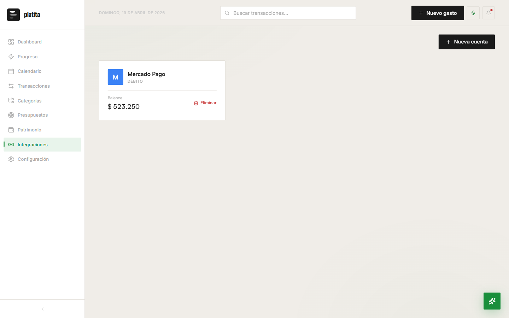
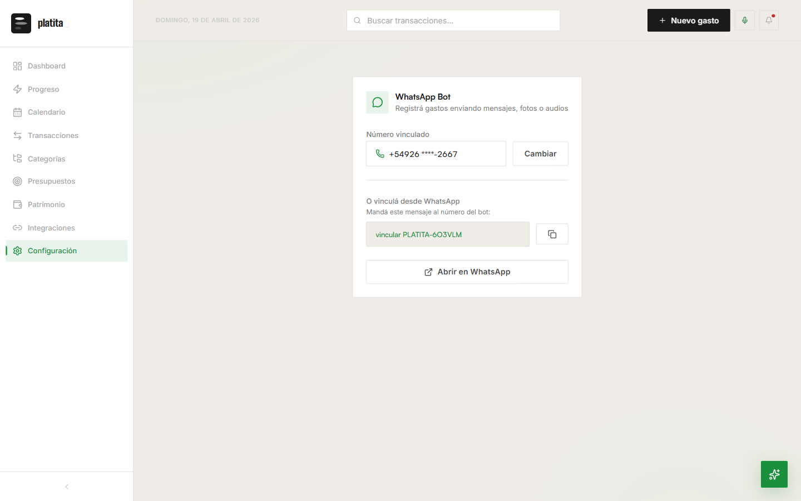

<div align="center">

# platita_

### Tus finanzas, en foco.

App de finanzas personales con asistente AI, bot de WhatsApp y gamificación.


---

> **Nota:** Este es un proyecto personal de aprendizaje y experimentación. No es un producto comercial ni tiene fines de lucro. Fue construido para explorar tecnologías modernas de desarrollo web, inteligencia artificial y arquitecturas serverless. Las capturas muestran un entorno de desarrollo con datos de prueba.

</div>

---

## Índice

1. [Qué es platita_](#qué-es-platita_)
2. [Capturas de pantalla](#capturas-de-pantalla) — recorrido por cada sección
3. [Features destacadas](#features-destacadas)
4. [Arquitectura y tecnologías](#arquitectura-y-tecnologías)
5. [Stack visual](#stack-visual)
6. [Flujos técnicos clave](#flujos-técnicos-clave)
7. [Seguridad y privacidad](#seguridad-y-privacidad)
8. [Estado del proyecto](#estado-del-proyecto) — qué está listo y qué está en proceso
9. [Roadmap](#roadmap)

---

## Qué es platita_?

**platita_** es una aplicación web de gestión de finanzas personales pensada para usuarios argentinos. Permite registrar ingresos y gastos, controlar presupuestos mensuales, visualizar el patrimonio neto con evolución histórica, programar eventos financieros en un calendario inteligente y recibir asistencia de un chatbot con inteligencia artificial que entiende tu situación financiera en tiempo real.

La app combina un **dashboard interactivo con gráficos** en Recharts, un **sistema de gamificación con XP, niveles, badges y rachas**, integración con **WhatsApp Business** para registrar gastos por texto / foto de ticket / nota de voz, **voice-to-expense** desde el navegador y un **asistente AI potenciado por RAG** (Retrieval-Augmented Generation) que consulta tus datos y una base de conocimiento financiero externa.

La estética es **Brutalist Mono Light**: tipografía monoespaciada, layout denso estilo terminal, alto contraste, sin degradés ni sombras innecesarias. Una sola pantalla concentra todo lo que importa del mes.

---

## Capturas de pantalla

Las capturas corresponden al estado de la app a la fecha del último commit. Se tomaron en resolución 1440x900 sobre el entorno de desarrollo con datos seed.

### 1. Login — Ingreso al Portal

Pantalla de acceso con diseño minimalista. Ofrece tres flujos:

- **Login clásico** con email + contraseña contra Supabase Auth.
- **Creación automática de cuenta** — si el email no existe, el sistema lo registra en el mismo flujo.
- **Código de invitación** opcional (`PLATITA-XXXXXX`) para vincularse al grafo de amigos al momento de registrarse.

Al ingresar por primera vez se dispara un trigger SQL (`seed_default_categories`) que siembra 10 categorías base en la cuenta (Comida, Alquiler, Transporte, Servicios, Salud, Entretenimiento, Otros, Sueldo, Freelance, Otro ingreso).


---

### 2. Dashboard — Vista principal

Es la landing page una vez autenticado. Muestra todo lo que necesitás para tomar una decisión financiera en el mes, en una sola pantalla.

**Widgets (de izquierda a derecha, arriba hacia abajo):**

- **HeroCard (Balance disponible del mes)** — Suma total de saldos de cuentas + comparación porcentual vs. mes anterior. Muestra ingresos y gastos del mes con % de cada uno sobre el total, y una **barra de meta de ahorro** con progreso (`ahorro / meta · 100%`).
- **Próximos eventos (widget lateral)** — Hasta 5 eventos financieros próximos en los próximos 5 días (pagos, cobros, cuotas), calculados con recurrencia O(1) sobre `scheduled_events`. Cada item muestra fecha, etiqueta relativa ("Hoy / Mañana / En N días"), categoría y monto.
- **Tendencia de gastos (últimos 6 meses)** — Sparkline con el monto del mes actual destacado.
- **Distribución (donut chart)** — Gastos del mes por categoría, con total centrado y leyenda con porcentajes.
- **Presupuestos del mes** — Presupuestos activos con barra de progreso (gastado / asignado), enlace "Gestionar" a la sección completa.
- **Últimas transacciones** — Feed de los últimos 5 movimientos (ingresos y cuotas incluidas).
- **Pill de nivel/XP** — Arriba a la derecha muestra nivel actual, apodo tematico ("Chanta Arrepentido", "Registrador Constante", etc.) y XP acumulado en una barra horizontal.

**Top bar:** fecha en formato largo en español, buscador global de transacciones, botón `+ Nuevo gasto` (abre modal rápido), botón micrófono (voice-to-expense), notificaciones.


---

### 3. Progreso — Gamificación

Sección completa de motivación y seguimiento de hábitos. Diseñada como "cara pública" del progreso financiero.

**Cards (de arriba hacia abajo):**

- **IdentityCard** — Apodo generado a partir del nivel ("Chanta Arrepentido" para el Nv. 1), avatar temático, badge de nivel, barra de progreso al siguiente nivel y título del próximo rango ("→ Registrador Constante").
- **StreakHeatmapCard** — Racha actual en días + racha máxima histórica + heatmap tipo GitHub (grilla de 7 filas × 52 semanas) con la actividad de registro del último año. Leyenda "menos → más".
- **ActiveQuestCard** — Quest semanal dinámica generada según tu estado actual. Ejemplo: "Llegá a 7 días de racha — Registrá un gasto por día esta semana". 3 sub-objetivos (3 días, 5 días, 7 días) con checkbox de progreso. Recompensa en XP visible en la esquina.
- **UpcomingRewardsCard** — Las próximas 3 badges más fáciles de desbloquear, con icono, descripción y XP al ganar.
- **BadgeCollectionGrid** — Las 10 badges del sistema. Las desbloqueadas se muestran a color con XP ganado; las bloqueadas en gris con condición (ej. "7 días consecutivos registrando gastos") y XP al ganar. Lista actual: *Primer Registro*, *Racha de Fuego*, *Mes Completo*, *Sin Excesos*, *Triple Sin Excesos*, *Presupuesto Perfecto*, *Primer Ahorro*, *Ahorrista Serio*, *Conector*, *Embajador*.

**Sistema de XP y niveles:** XP se otorga automáticamente al registrar transacciones, mantener rachas, cumplir presupuestos y desbloquear badges. La tabla de niveles va del **Nv. 1 (Chanta Arrepentido — 0 XP)** al **Nv. 10+ (Ahorrista Legendario — 10.000 XP)**, con nombres tematicos intermedios (Registrador Constante, Presupuestador, Estratega, etc.).


---

### 4. Calendario — Eventos financieros

Calendario mensual tipo Google Calendar, pero especializado en flujo de caja. Muestra una vista `6 × 7` (42 celdas) con el mes actual + padding para completar semanas.

**Columna central:**

- **Resumen del mes** — Ingresos totales (verde) vs. gastos totales (rojo) con una barra de cash-flow que indica en qué día del mes estás hoy (marcador vertical) y el monto efectivo acumulado hasta ahora.
- **Grid mensual** — Cada día muestra puntos de colores (verde = ingreso, negro = gasto, anillo = recurrente), con el tamaño del punto proporcional al monto. Día actual destacado con borde grueso. Navegación `‹ HOY ›` para avanzar/retroceder meses.
- **Leyenda** — Código de colores y "Click en un día para el detalle".

**Columna lateral (día seleccionado):**

- **Header del día** — Fecha larga + total neto (verde si positivo, rojo si negativo).
- **Detalle de movimientos** — Ingresos y gastos del día seleccionado, con monto y descripción.
- **Botón "+ Agregar evento al día N"** — Abre modal para crear un evento futuro (pago, cobro, recurrente).
- **Cuotas vigentes** — Acordeón con las cuotas de tarjeta que vencen ese mes.
- **Google Calendar** — Badge "Conectar / Sincronizado" según estado OAuth. Cuando está conectado, los eventos se sincronizan bidireccionalmente.
- **Gastos fijos / mes** — Acordeón con los recurrentes activos (ej. "Alquiler -$35.000 · 1 activo"), con botón "+ Agregar gasto recurrente".

**Recurrencias soportadas:** `none`, `daily`, `weekly`, `biweekly`, `monthly`, `yearly`. La expansión de eventos recurrentes usa aritmética O(1) (`firstOccurrenceAtOrAfter`) — no itera día a día, por lo que soporta recurrentes con cualquier antigüedad sin degradación de performance.


---

### 5. Transacciones — Tabla de movimientos

Página tipo hoja de cálculo para revisar y editar todos los movimientos. Combina **ingresos, gastos y cuotas de tarjeta** en una sola vista.

**Header:**

- **Banner de insight IA** — Un insight automatico del mes ("Estás ahorrando 90% de tus ingresos. Tu día más caro fue 2026-04-19 con $50.000") con botón "Análisis IA" para profundizar.
- **Título + subtítulo** — "Tus movimientos — Todo lo que entró y salió, editable línea por línea. Tocá cualquier campo para modificarlo."
- **Selector de período** — Últimos 30 días / Este mes / Mes anterior / Personalizado.

**KPI cards (arriba):**

- **Ingresos** — Total del período + sparkline verde + % vs. período anterior.
- **Gastos** — Total + sparkline rojo + % vs. período anterior.
- **Balance neto** — Diferencia + tasa de ahorro calculada (`(ingresos - gastos) / ingresos × 100`).

**Analytics secundarios:**

- **Flujo diario** — Mini histograma de ingresos/gastos por día del período.
- **Por categoría** — Donut de los gastos del período con leyenda.
- **Top comercios** — Ranking de los 3 merchants con mayor gasto + cantidad de compras.

**Tabla principal:**

- **Filtros:** Todos / Gastos / Ingresos, buscador por concepto (debounced 250ms), botón `+ Filtros` (categoría, cuenta, monto min/max, rango de fechas).
- **Columnas:** checkbox (selección), concepto (editable inline), categoría (dropdown editable inline con scope `applies_to`), cuenta, fecha, monto.
- **Selección múltiple:** al seleccionar una o más filas aparece `BulkActionBar` con acciones — cambiar categoría en masa, eliminar en masa. El scope de categorías disponibles se filtra por el tipo de las filas seleccionadas (ingresos → categorías `income`+`both`, gastos → `expense`+`both`, mixto → solo `both`).
- **Merge en JS:** `getTransactions()` une `transactions` + `credit_installments` pendientes en la capa de aplicación, porque PostgREST no permite filtrar sobre joins anidados.


---

### 6. Categorías — Personalización

Gestión de categorías de ingresos y gastos con emoji, label, color y scope.

**Características:**

- **Scope (`applies_to`)** — Cada categoría es `ingreso`, `gasto` o `ambos`. El badge debajo del nombre lo muestra.
- **Color identificador** — Picker de color (círculo lateral) que define la paleta en gráficos y badges.
- **Emoji personalizable** — Icono visual que aparece en tablas, modales y widgets.
- **Categorías protegidas** — Las defaults traen un candado 🔒 que evita borrarlas (comida, alquiler, transporte, etc.); seguís pudiendo editarles label y color.
- **Botón `+ Nueva categoría`** — Abre modal de creación con campos nombre, slug (auto-generado), emoji, color, tipo.

Las defaults en el screenshot: *Comida (gasto)*, *Alquiler (gasto)*, *Transporte (gasto)*, *Servicios (gasto)*, *Entretenimiento (gasto)*, *Salud (gasto)*, *Otros (ambos)*, *Freelance (ingreso)*, *Inversión (ingreso)*, *Otro ingreso (ingreso)*, *Reembolso (ingreso)*, *Regalo (ingreso)*, *Sueldo (ingreso)*.


---

### 7. Presupuestos — Límites por categoría

Creación de presupuestos **mensuales** por categoría con seguimiento visual del gasto en tiempo real.

**Cada card muestra:**

- **Emoji + nombre de la categoría**.
- **Monto gastado / monto asignado** (ej. `$30.000 / $70.000`).
- **Barra de progreso** — Verde debajo del 75%, amarilla 75-100%, roja arriba del 100% (alerta de excedido).
- **Porcentaje** del mes consumido.
- **Remanente** — `Quedan $ N`.
- **Acciones** — Editar (lápiz), eliminar (basurero).

**Lógica:**

- Los presupuestos son **por mes calendario** y se resetean automáticamente el día 1 vía cron de Inngest.
- El spent calculado incluye tanto transacciones como cuotas pendientes vencidas en el mes.
- Al sobrepasar un presupuesto se dispara un evento que puede notificar al usuario.
- Al cumplir 1 mes sin exceder ningún presupuesto, se desbloquea la badge *Sin Excesos* (+12 XP).


---

### 8. Patrimonio — Net worth

Vista agregada de activos y pasivos con evolución histórica.

**Cards principales:**

- **Patrimonio Neto** — Total = Activos − Pasivos. Incluye variación absoluta y porcentual vs. mes anterior.
- **Activos** — Suma de balances de todas las cuentas activas, con count ("1 cuenta activa").
- **Pasivos** — Suma de cuotas pendientes futuras de compras en cuotas, con count ("0 compras en cuotas").

**Gráfico de evolución:**

- **LineChart con 3 series** — Patrimonio (verde), Activos (verde claro), Deudas (rojo). Eje X con los últimos ~35 días, eje Y auto-escalado en pesos argentinos.
- **Tooltip on-hover** con el valor exacto de cada serie en ese punto.

**Detalle (abajo):**

- **Detalle de activos** — Lista de cuentas con tipo (débito, crédito, efectivo, billetera virtual) y balance.
- **Detalle de pasivos** — Lista de compras en cuotas pendientes, con cuotas restantes y monto total adeudado. "No hay cuotas pendientes" si corresponde.


---

### 9. Asistente AI — platita_ AI (chat flotante)

Chatbot accesible desde cualquier pantalla vía botón flotante (esquina inferior derecha, ícono de "spark").

**Capacidades:**

- **Consultar datos financieros** — "¿Cuánto gasté en comida este mes?", "¿Cuál fue mi mes con mayor ahorro?", "Dame mi top 5 de categorías del trimestre".
- **Registrar gastos por chat** — "Registrá $5.000 en transporte hoy" → confirmación → creación automática.
- **Dar consejos basados en tu situación real** — Inyecta contexto financiero (balance, gastos del mes, presupuestos, etc.) al prompt.
- **Preguntas generales** — Usa RAG con base de conocimiento financiero externa (tips de ahorro, productos bancarios argentinos, etc.).
- **Actions con confirmación** — Toda mutación (crear transacción, borrar, actualizar) exige click de confirmación del usuario antes de ejecutarse.

**Stack del chat:**

- **Clasificador de intent** — Un primer prompt etiqueta el mensaje en `query_data | register_expense | general_advice | irrelevant`.
- **Context injection** — Según el intent, se arma el contexto: últimas N transacciones, presupuestos, balance, etc.
- **RAG** — Si el intent es `general_advice`, se buscan los top 3 chunks más similares en `knowledge_base` vía embeddings (pgvector + HNSW).
- **Streaming** — Respuesta streameada token a token con Vercel AI SDK.
- **Cleanup de historial** — Botón de basurero limpia la conversación actual.


---

### 10. Integraciones — Cuentas y billeteras

Hub de gestión de cuentas financieras vinculadas. Cada cuenta suma al patrimonio neto.

**Tipos de cuenta soportados:**

- **Mercado Pago** (billetera virtual argentina) — Permite trackear balance manualmente.
- **Cuentas bancarias** (débito, ahorro, corriente).
- **Cuentas de crédito** (para separar compras en cuotas del flujo regular).
- **Efectivo** (cuenta virtual para gastos offline).

**Cada card muestra:**

- **Logo/avatar** de la institución (letra inicial colorizada).
- **Nombre** de la cuenta.
- **Tipo** (Débito / Crédito / Efectivo / Virtual).
- **Balance actual** (editable).
- **Botón Eliminar** — Con confirmación, también borra todas las transacciones asociadas.

**Botón `+ Nueva cuenta`** abre modal de creación con campos nombre, tipo, balance inicial y color/avatar.



---

### 11. Configuración — WhatsApp Bot

Sección de ajustes del usuario. Actualmente concentra la vinculación del bot de WhatsApp; crecerá a perfil, notificaciones, privacidad, export de datos.

**WhatsApp Bot card:**

- **Número vinculado** — Muestra el número vinculado con los dígitos centrales ofuscados (`+54926 ****-2667`). Botón "Cambiar" para re-vincular.
- **Flujo de vinculación alternativo** — Si no tenés un número, se muestra una **mágica string** (`vincular PLATITA-6O3VLM`). El usuario manda ese mensaje al número del bot y queda vinculado automaticamente por el webhook (match del código por regex).
- **Botón "Copiar"** — Copia el string al portapapeles.
- **Botón "Abrir en WhatsApp"** — Deep link `https://wa.me/<BOT_NUMBER>?text=vincular+PLATITA-XXXXXX`.

**Bot flow detrás:**

1. Usuario manda texto, foto o audio al bot.
2. Webhook de Meta Graph API recibe con verificación HMAC-SHA256 del header `x-hub-signature-256`.
3. Inngest dispara el workflow `whatsapp.message.received`.
4. Según el tipo de mensaje: texto → intent classifier; foto → GPT-4o vision OCR; audio → Whisper transcribe + intent classifier.
5. Extracción estructurada (Zod schema) de `{monto, categoria, descripcion, fecha}`.
6. Confirmación opcional al usuario por el mismo bot.
7. Inserción en DB con `profile_id` del número vinculado.



---

## Features destacadas

| Feature | Descripción |
|---|---|
| **AI Chat con RAG** | Asistente conversacional que consulta tus datos financieros en tiempo real y una base de conocimiento externa usando embeddings vectoriales (pgvector + HNSW index). |
| **WhatsApp Bot** | Registra gastos enviando texto, fotos de tickets o notas de voz al bot. Usa GPT-4o para OCR de tickets y Whisper para transcripción de audio en español. |
| **Voice-to-Expense** | Grabá un audio desde el browser (botón micrófono en la top bar) y la app extrae automáticamente monto, categoría y descripción con Whisper + GPT-4o-mini. |
| **Gamificación completa** | Sistema de XP, niveles con nombres temáticos, 10 badges desbloqueables, rachas con heatmap tipo GitHub y quests semanales dinámicas. |
| **Health Score** | Puntuación de salud financiera calculada con 6 criterios: tasa de ahorro, diversificación de categorías, adherencia a presupuesto, consistencia de registro, ratio deuda/ingresos y liquidez. |
| **Calendario inteligente** | Eventos recurrentes con expansión O(1), sincronización bidireccional con Google Calendar vía OAuth, vista de flujo de caja día a día. |
| **Cuotas de tarjeta** | Registro de compras en cuotas con generación automática de schedule mensual y vencimientos; se cruzan con presupuestos y patrimonio. |
| **Patrimonio neto histórico** | Snapshot diario de balances → gráfico de evolución de activos, pasivos y net worth en ventana ajustable. |
| **Insights automáticos** | Banner contextual en transacciones con insights del mes (tasa de ahorro, día más caro, categoría dominante) generados por GPT-4o-mini. |
| **Multi-cuenta** | Soporte para múltiples cuentas bancarias, billeteras virtuales, efectivo y tarjetas de crédito, con balance consolidado. |
| **Presupuestos con alertas** | Límites mensuales por categoría, reset automático el día 1 vía cron de Inngest, notificaciones al superar el umbral. |
| **Invite-based friend graph** | Cada usuario tiene un `invite_code` (`PLATITA-XXXXXX`) para invitar amigos; se usa para ranking social de XP (en desarrollo). |

---

## Arquitectura y tecnologías

### Frontend

- **[Next.js 16](https://nextjs.org/)** — App Router, Server Components, Server Actions, Turbopack.
- **[React 19](https://react.dev/)** — Última versión con soporte completo para Server Components y nuevas APIs de transiciones.
- **[TypeScript](https://www.typescriptlang.org/) 5+** — Modo `strict` en todo el codebase.
- **[Tailwind CSS v4](https://tailwindcss.com/)** — CSS variables para theming dinámico. Tema actual: *Brutalist Mono Light*.
- **[Recharts](https://recharts.org/)** — Gráficos interactivos (líneas, donut, barras, heatmaps).
- **[Framer Motion](https://www.framer.com/motion/)** — Animaciones y transiciones fluidas del sidebar, modales y widgets.
- **[lucide-react](https://lucide.dev/)** — Icon set consistente.

### Backend y base de datos

- **[Supabase](https://supabase.com/)** — PostgreSQL gestionado + Auth + Realtime + Row Level Security.
- **[pgvector](https://github.com/pgvector/pgvector)** — Extensión de PostgreSQL para almacenar y buscar embeddings (con HNSW index para búsqueda aproximada ultrarrápida).
- **Server Actions de Next.js** — Todas las mutaciones corren server-side con validación Zod y protección IDOR (`.eq('profile_id', user.id)` en cada query).
- **Middleware de auth (`src/middleware.ts`)** — Protección automática de rutas excepto `/login`, `/auth/*`, `/api/*`.
- **RPC functions (SQL)** — Queries complejas (heatmap, evolución de patrimonio, top merchants) corren en Postgres, no en JS.

### Inteligencia artificial

- **[OpenAI GPT-4o-mini](https://platform.openai.com/docs/models)** — Chat conversacional, clasificación de intents, generación de insights.
- **[OpenAI GPT-4o](https://platform.openai.com/docs/models)** — Visión: OCR de tickets desde fotos.
- **[OpenAI Whisper](https://platform.openai.com/docs/guides/speech-to-text)** — Transcripción de audio en español.
- **[text-embedding-3-small](https://platform.openai.com/docs/guides/embeddings)** — Generación de embeddings 1536-dim para RAG.
- **[Vercel AI SDK](https://ai-sdk.dev/)** — Streaming de respuestas y `generateObject` para structured output con Zod schema.
- **RAG Pipeline** — Crawler → chunker (semantic split) → embedder → `knowledge_base` table (pgvector + HNSW).

### Jobs asincrónicos y eventos

- **[Inngest](https://www.inngest.com/)** — Workflows en background con steps confiables y retry automático:
  - `whatsapp.message.received` — Orquesta el parseo del mensaje → llamada a OpenAI → insert en DB → respuesta al usuario.
  - `xp.awarded` — Recalcula nivel y dispara badges desbloqueables.
  - `budget.monthly.reset` (cron) — Resetea presupuestos el día 1 de cada mes.
  - `knowledge.crawl` — Crawling periódico de fuentes externas para la base RAG.

### Integraciones externas

- **[Meta Graph API](https://developers.facebook.com/docs/graph-api)** — WhatsApp Business Cloud API (texto + multimedia) con verificación HMAC-SHA256 del webhook.
- **[Google Calendar API](https://developers.google.com/workspace/calendar)** — Sincronización OAuth 2.0 bidireccional de eventos financieros.
- **[Mercado Pago API](https://www.mercadopago.com.ar/developers)** *(opcional, en desarrollo)* — Vinculación de billetera para import automático.

### Herramientas de desarrollo

- **[Vitest](https://vitest.dev/)** — Tests unitarios sobre server actions y helpers puros. 294 tests actualmente (bump en cada feature).
- **[ESLint](https://eslint.org/) + [Prettier](https://prettier.io/)** — Lint estricto (config de Next.js) + formato automático.
- **[Claude Code](https://www.anthropic.com/claude-code) + Superpowers Skills** — Desarrollo asistido por AI con skills especializadas (brainstorming, TDD, debugging, code review, feature development).
- **[MCP Servers](https://modelcontextprotocol.io/)** — Playwright MCP para testing de browser, Supabase MCP para gestión de DB directa desde el editor.
- **[Vercel](https://vercel.com/)** — Deploy automático con preview deployments por PR y production por push a `master`.

---

## Stack visual

```
┌────────────────────────────────────────────────────────────┐
│                        FRONTEND                            │
│  Next.js 16 · React 19 · TypeScript · Tailwind v4          │
│  Recharts · Framer Motion · lucide-react                   │
├────────────────────────────────────────────────────────────┤
│                      SERVER LAYER                          │
│  Server Actions · Server Components · Middleware Auth      │
│  Zod Validation · Rate Limiting · IDOR Guards              │
├────────────────────────────────────────────────────────────┤
│                      AI / ML LAYER                         │
│  GPT-4o-mini (chat, intents, insights)                     │
│  GPT-4o (vision — OCR tickets)                             │
│  Whisper (speech-to-text ES)                               │
│  RAG: pgvector + HNSW · Vercel AI SDK (streaming)          │
├────────────────────────────────────────────────────────────┤
│                    ASYNC / EVENTS                          │
│  Inngest: WhatsApp flow · XP events · Budget cron · Crawl  │
├────────────────────────────────────────────────────────────┤
│                       DATABASE                             │
│  Supabase (Postgres + Auth + RLS + Realtime)               │
│  pgvector (embeddings) · RPC functions · Triggers          │
├────────────────────────────────────────────────────────────┤
│                     INTEGRATIONS                           │
│  WhatsApp (Meta API) · Google Calendar · Mercado Pago      │
├────────────────────────────────────────────────────────────┤
│                      DEPLOYMENT                            │
│  Vercel · MCP Servers · Claude Code + Superpowers          │
└────────────────────────────────────────────────────────────┘
```

---

## Flujos técnicos clave

### Registro de gasto por WhatsApp (texto / foto / audio)

```
Usuario en WhatsApp
   │
   ▼
Meta Graph API webhook ──► Next.js /api/webhooks/whatsapp
   │ (HMAC-SHA256 verification)
   ▼
Inngest event: whatsapp.message.received
   │
   ├─► text    → intent-classifier → extract {monto, categoría, fecha}
   ├─► image   → GPT-4o vision OCR  → extract structured fields
   └─► audio   → Whisper transcribe → intent-classifier
   │
   ▼
Zod validate → Supabase insert (transactions)
   │
   ▼
Respuesta al usuario vía WhatsApp ("Listo, registré $5.000 en Comida 🍔")
   │
   ▼
Inngest event: xp.awarded → update profile XP → check badges
```

### Consulta al AI Chat

```
Usuario escribe en el widget
   │
   ▼
POST /api/chat (Vercel AI SDK)
   │
   ▼
Intent classifier (GPT-4o-mini)
   │
   ├─► query_data      → data-queries.ts (fetch contexto) → GPT-4o-mini streaming
   ├─► register_expense → extract {amount, category} → confirmation UI
   ├─► general_advice  → pgvector similarity search (top 3 chunks) → GPT-4o-mini + RAG context
   └─► irrelevant      → respuesta corta ("Soy platita_, solo sé de finanzas")
   │
   ▼
Respuesta streameada al cliente (token a token)
```

### Eventos recurrentes — cálculo O(1)

```
Para cada evento con recurrence ≠ 'none':
  firstOccurrenceAtOrAfter(eventStart, targetDate, recurrence):
     cálculo aritmético directo (UTC-safe) — NO itera día a día.
     · daily:   Δdays = (target - start) / 86400 → add ceil(Δ) days
     · weekly:  Δweeks = Δdays / 7         → add ceil(Δ) * 7 days
     · monthly: diff month + day clamping con setUTCMonth
     · yearly:  diff year + setUTCFullYear
```

---

## Seguridad y privacidad

- **Row Level Security (RLS)** — Cada tabla de la app tiene policies que verifican `auth.uid() = profile_id` antes de leer/escribir.
- **IDOR guards en server actions** — Además de RLS, todo server action re-verifica `{data:{user}} = await supabase.auth.getUser()` y filtra con `.eq('profile_id', user.id)`. Defense-in-depth.
- **Validación Zod en el borde** — Todo input externo (form, webhook, API route) pasa por `safeParse` antes de tocar la DB.
- **HMAC-SHA256 en webhooks** — El webhook de WhatsApp verifica la firma `x-hub-signature-256` antes de procesar payloads.
- **Secrets en env vars** — `.env.local` nunca se commitea, secrets rotan via Vercel dashboard.
- **Auditor CTO-grade** — Subagente dedicado (`/auditar`) revisa cada feature buscando bugs funcionales (TZ drift, off-by-one, race conditions), comparaciones mal formadas, labels stale. Cada auditoría se registra en `Issues encontrados-Historial de arreglo/` y en la knowledge base interna.

---

## Estado del proyecto

Este proyecto está en **desarrollo activo** como proyecto personal. Algunas funcionalidades están listas y otras en proceso:

### Listo ✅

- Dashboard con métricas, KPIs y gráficos (rediseñado 2026-04-19)
- CRUD completo de transacciones, categorías, presupuestos, cuentas
- Sistema de cuotas de tarjeta (compras → schedule mensual automático)
- Patrimonio neto con evolución histórica
- Calendario financiero con eventos recurrentes (daily/weekly/biweekly/monthly/yearly)
- Asistente AI con RAG y consultas sobre datos financieros
- Gamificación completa (XP, niveles, 10 badges, rachas, quests semanales, heatmap)
- Voice-to-expense (grabación de audio en el browser)
- WhatsApp bot (texto, foto OCR, audio Whisper)
- Integración Google Calendar (OAuth + sync bidireccional)
- Top bar con búsqueda global y shortcuts
- Insights automáticos del mes (banner IA en transacciones)
- Suite de tests (Vitest, 294+ tests)
- Deploy automático a Vercel
- Auditor CTO-grade (bugs, sintaxis, deuda técnica)

### En proceso 🔧

- **Integración completa con Mercado Pago** — Import automático de movimientos vía API oficial.
- **Notificaciones push** (browser + email) — Alertas cuando se supera presupuesto, recordatorio de pagos, insights semanales.
- **Ranking social de XP entre amigos** — Backend de friend graph listo, falta UI.
- **Export de datos** — PDF de reportes mensuales y CSV completo.
- **Análisis IA extendido** — Comparativa YoY, detección de gastos anómalos, proyección de flujo con forecasting.
- **App mobile nativa** — Probablemente con React Native + Expo compartiendo lógica con el web.
- **Multi-moneda** — Soporte ARS + USD + EUR con conversión automática a la moneda base.
- **Scheduled transactions** (auto-create) — Programar que una transacción recurrente se inserte sola el día que toca.
- **Categorías inteligentes con ML** — Auto-categorización de transacciones basada en la descripción/merchant.

### Experimental / Futuro 🧪

- Chat con voz bidireccional (speak + listen) en el widget.
- Metas de ahorro con tracking y nudges IA.
- "Widgets del home" del celular vía PWA.
- Compartir presupuestos con pareja / grupo.
- OCR de facturas de servicios (luz, gas, internet) para detectar subas.

---

## Roadmap

Orden aproximado de trabajo para los próximos sprints:

1. **Notificaciones push** — Alertas de presupuesto y recordatorios de pago.
2. **Mercado Pago import** — API oficial de MP para traer movimientos automáticamente.
3. **Ranking social** — Leaderboard de amigos vinculados por invite code.
4. **Export reportes** — PDF mensual con charts + CSV completo.
5. **Análisis IA extendido** — Detección de anomalías, comparativa YoY, forecasting.
6. **Multi-moneda** — ARS + USD con FX rate diaria.
7. **Auto-categorización** — Modelo ligero para sugerir categoría al registrar.
8. **App mobile** — React Native / Expo.

---

<div align="center">

**Hecho con mucho café y curiosidad por [@matemartiin](https://github.com/matemartiin)**

*Buenos Aires, Argentina · 2026*

</div>
