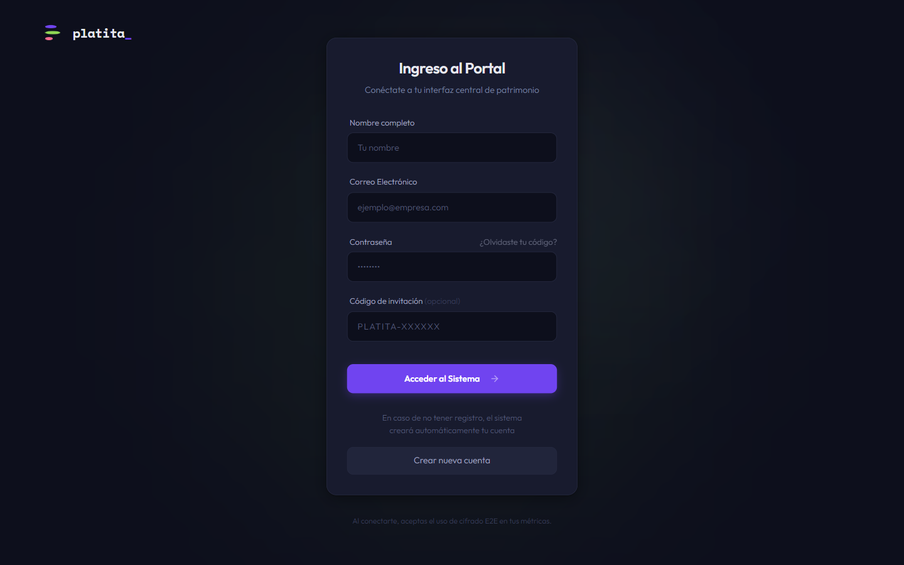
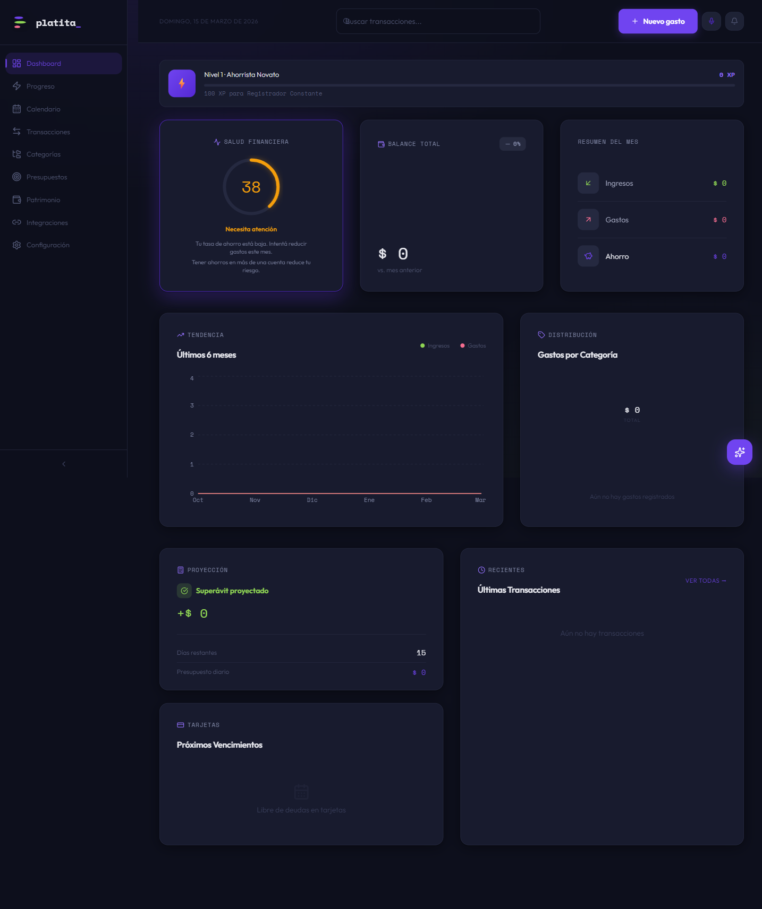
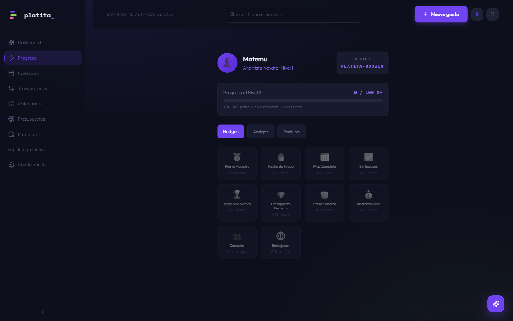
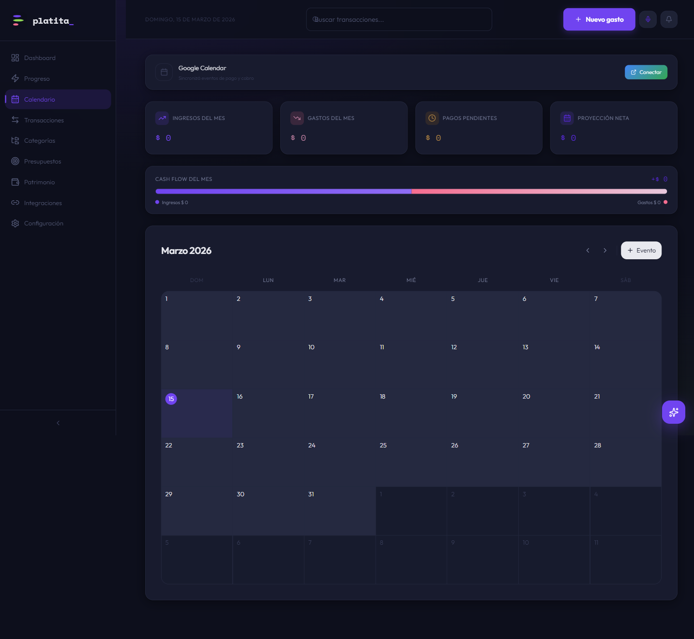
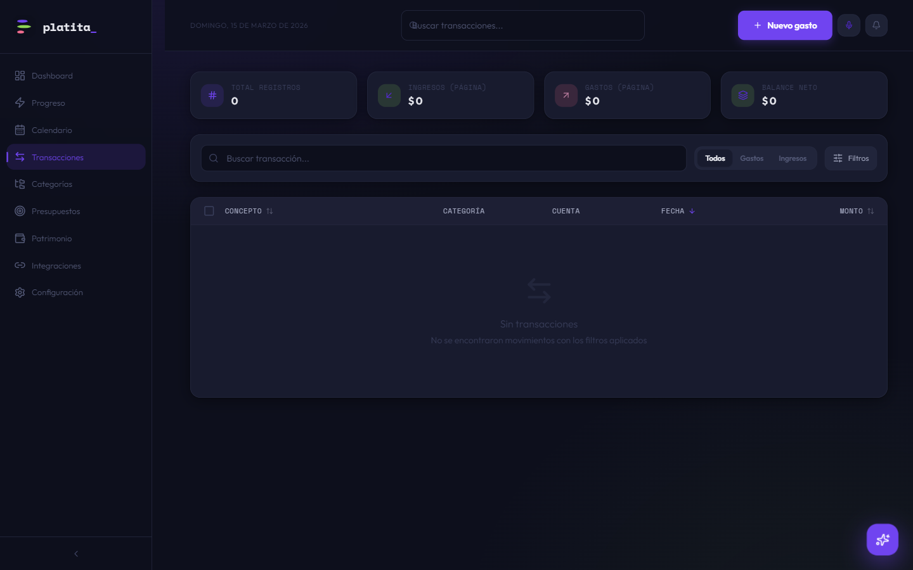
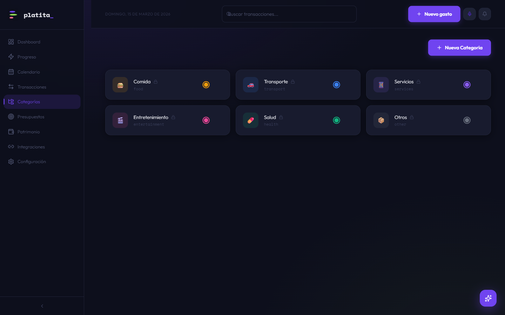
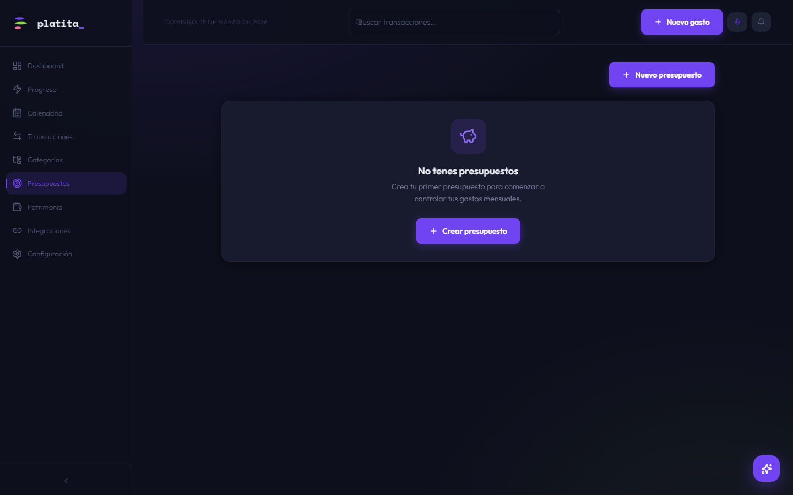
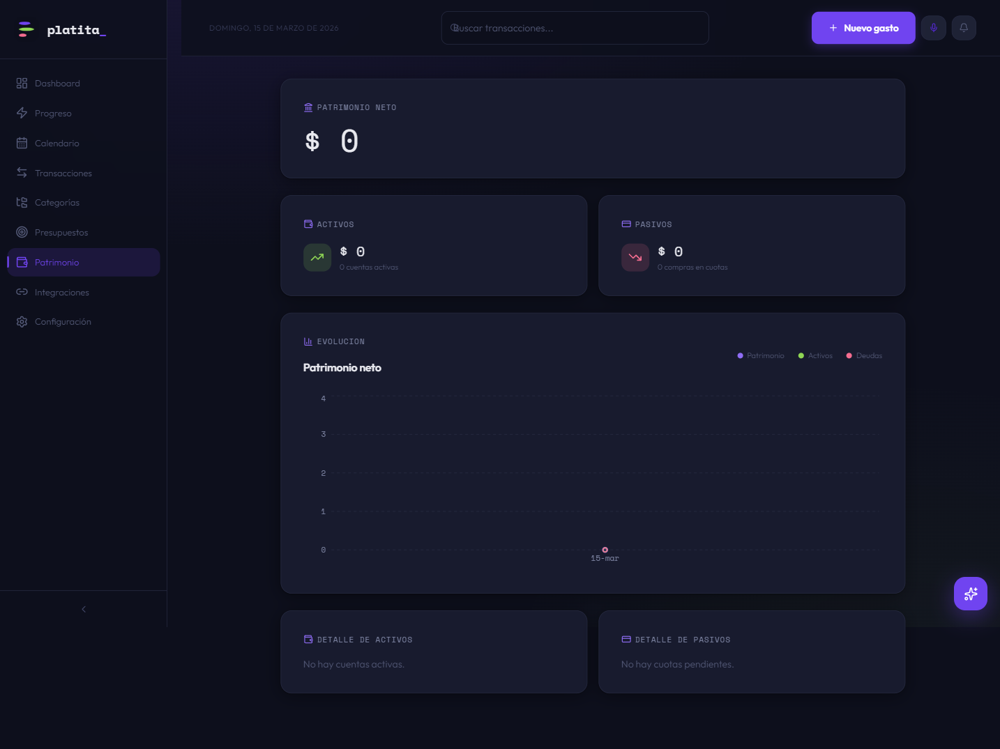
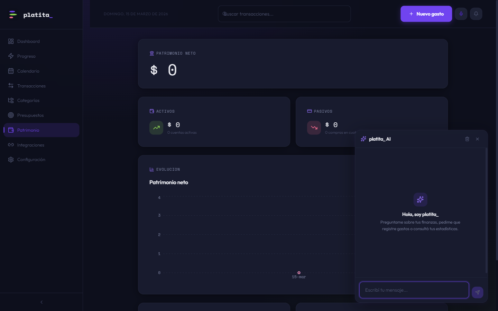
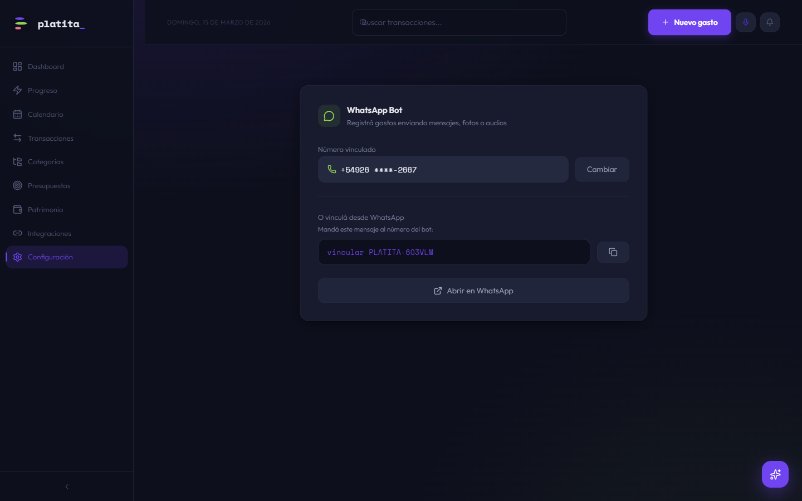

<div align="center">

# platita_

### Tus finanzas, en foco.

App de finanzas personales con asistente AI, bot de WhatsApp y gamificacion.


---

> **Nota:** Este es un proyecto personal de aprendizaje y experimentacion. No es un producto comercial ni tiene fines de lucro. Fue construido para explorar tecnologias modernas de desarrollo web, inteligencia artificial y arquitecturas serverless.

</div>

---

## Que es platita_?

**platita_** es una aplicacion web de gestion de finanzas personales pensada para usuarios argentinos. Permite registrar ingresos y gastos, controlar presupuestos, visualizar el patrimonio neto y recibir asistencia de un chatbot con inteligencia artificial que entiende tu situacion financiera.

La app combina un dashboard interactivo con graficos en tiempo real, un sistema de gamificacion con XP y badges, integracion con WhatsApp para registrar gastos por mensaje/foto/audio, y un asistente AI potenciado por RAG (Retrieval-Augmented Generation) que puede consultar tus datos financieros y responder preguntas contextuales.

---

## Capturas de pantalla

### Login

Pantalla de ingreso con diseno glassmorphism y tema oscuro. Soporta creacion automatica de cuenta y codigos de invitacion para el sistema de amigos.



---

### Dashboard

Vista principal con todos los indicadores financieros de un vistazo:
- **Salud Financiera** — Score calculado con 6 criterios (tasa de ahorro, diversificacion, presupuestos, etc.)
- **Balance Total** — Con comparacion vs. mes anterior
- **Resumen del Mes** — Ingresos, gastos y ahorro
- **Tendencia** — Grafico de lineas de los ultimos 6 meses
- **Distribucion** — Donut chart de gastos por categoria
- **Proyeccion** — Presupuesto diario restante y superavit proyectado
- **Tarjetas** — Proximos vencimientos de cuotas
- **Ultimas Transacciones** — Feed de movimientos recientes



---

### Progreso y Gamificacion

Sistema de XP, niveles y badges que motiva a mantener buenos habitos financieros:
- **10 badges** desbloqueables (Primer Registro, Racha de Fuego, Mes Completo, Presupuesto Perfecto, etc.)
- **Sistema de niveles** con nombres tematicos (Ahorrista Novato, Registrador Constante, ...)
- **Codigo de invitacion** unico para agregar amigos
- **Tabs de Amigos y Ranking** para competir con tu circulo



---

### Calendario Financiero

Calendario mensual con vista de eventos financieros:
- **Resumen del mes** — Ingresos, gastos, pagos pendientes y proyeccion neta
- **Cash Flow** — Barra visual de flujo de caja
- **Creacion de eventos** — Programar pagos y cobros futuros
- **Integracion con Google Calendar** — Sincronizacion bidireccional via OAuth



---

### Transacciones

Tabla avanzada con filtros y busqueda:
- **Filtros por tipo** — Todos, Gastos, Ingresos
- **Busqueda** por concepto
- **Ordenamiento** por fecha, monto o concepto
- **Metricas en tiempo real** — Total registros, ingresos, gastos y balance neto
- **Seleccion multiple** para eliminacion en lote



---

### Categorias

Gestion de categorias de gastos e ingresos con emojis y colores personalizables. Las categorias por defecto incluyen Comida, Transporte, Servicios, Entretenimiento, Salud y Otros.



---

### Presupuestos

Creacion de presupuestos mensuales por categoria con seguimiento visual del gasto vs. limite asignado.



---

### Patrimonio

Vista completa del patrimonio neto con:
- **Activos** — Cuentas bancarias, billeteras digitales
- **Pasivos** — Compras en cuotas pendientes
- **Evolucion** — Grafico historico de patrimonio neto, activos y deudas



---

### Asistente AI (platita_ AI)

Chat flotante con inteligencia artificial que puede:
- **Consultar tus datos** — "Cuanto gaste en comida este mes?"
- **Registrar gastos** — "Registra un gasto de $5000 en transporte"
- **Dar consejos** — Basados en tu situacion financiera real
- **Responder preguntas** — Usando RAG con base de conocimiento financiero

Potenciado por GPT-4o-mini con clasificacion de intents, inyeccion de contexto financiero y confirmacion de acciones.



---

### Configuracion — WhatsApp Bot

Vinculacion del bot de WhatsApp para registrar gastos de forma conversacional:
- **Texto** — "Gaste $3000 en el super"
- **Foto** — Envia una foto del ticket y se extrae automaticamente (OCR con GPT-4o)
- **Audio** — Graba un mensaje de voz y se transcribe con Whisper



---

## Features destacadas

| Feature | Descripcion |
|---------|-------------|
| **AI Chat con RAG** | Asistente conversacional que consulta tus datos financieros en tiempo real y una base de conocimiento externa usando embeddings vectoriales (pgvector) |
| **WhatsApp Bot** | Registra gastos enviando texto, fotos de tickets o notas de voz al bot. Usa GPT-4o para OCR y Whisper para transcripcion |
| **Voice-to-Expense** | Graba un audio desde el browser y la app extrae automaticamente monto, categoria y descripcion |
| **Gamificacion** | Sistema de XP, niveles, badges y ranking entre amigos para motivar buenos habitos financieros |
| **Health Score** | Puntuacion de salud financiera calculada con 6 criterios: ahorro, diversificacion, presupuesto, consistencia, deuda y liquidez |
| **Google Calendar** | Sincronizacion de eventos financieros (pagos, cobros) con Google Calendar via OAuth |
| **Cuotas de tarjeta** | Registro y seguimiento de compras en cuotas con vencimientos automaticos |
| **Patrimonio neto** | Seguimiento historico de activos y pasivos con grafico de evolucion |

---

## Arquitectura y tecnologias

### Frontend
- **Next.js 16** — App Router, Server Components, Server Actions
- **React 19** — Ultima version con soporte para Server Components
- **TypeScript** — Modo estricto para type safety
- **Tailwind CSS v4** — CSS variables para theming dinamico
- **Recharts** — Graficos interactivos (lineas, donut, barras)
- **Framer Motion** — Animaciones fluidas
- **Radix UI** — Componentes accesibles (dialogs, dropdowns, popovers)
- **TanStack Table** — Tablas avanzadas con ordenamiento y filtros

### Backend y base de datos
- **Supabase** — PostgreSQL + Auth + Realtime + Row Level Security
- **pgvector** — Extension de PostgreSQL para embeddings vectoriales (RAG)
- **Server Actions** — Mutaciones seguras con validacion Zod y proteccion IDOR
- **Middleware de auth** — Proteccion automatica de rutas con Supabase SSR

### Inteligencia artificial
- **OpenAI GPT-4o-mini** — Chat y clasificacion de intents
- **OpenAI GPT-4o** — Analisis de imagenes (OCR de tickets)
- **OpenAI Whisper** — Transcripcion de audio (espanol)
- **text-embedding-3-small** — Generacion de embeddings para RAG
- **Vercel AI SDK** — Streaming de respuestas y structured output
- **RAG Pipeline** — Crawling de fuentes → chunking → embedding → vector search con HNSW index

### Jobs asincrono y eventos
- **Inngest** — Workflows en background con steps confiables (WhatsApp bot, XP events, cron de presupuestos)

### Integraciones externas
- **Meta Graph API** — WhatsApp Business para el bot de gastos (con verificacion HMAC-SHA256)
- **Google Calendar API** — Sincronizacion OAuth de eventos financieros
- **Mercado Pago** — (Opcional) Vinculacion de billetera

### Herramientas de desarrollo
- **Claude Code + Superpowers Skills** — Desarrollo asistido por AI con skills especializadas (brainstorming, TDD, debugging, code review, feature development)
- **MCP Servers** — Playwright MCP para testing de browser, Supabase MCP para gestion de base de datos
- **Vercel** — Deploy automatico con preview deployments

---

## Stack visual

```
┌─────────────────────────────────────────────────────────┐
│                      FRONTEND                           │
│  Next.js 16 · React 19 · TypeScript · Tailwind v4      │
│  Recharts · Framer Motion · Radix UI · TanStack Table   │
├─────────────────────────────────────────────────────────┤
│                    SERVER LAYER                          │
│  Server Actions · Server Components · Middleware Auth    │
│  Zod Validation · Rate Limiting                         │
├─────────────────────────────────────────────────────────┤
│                   AI / ML LAYER                         │
│  GPT-4o-mini (chat) · GPT-4o (vision) · Whisper (STT)  │
│  RAG: pgvector + HNSW · Intent Classification           │
│  Vercel AI SDK (streaming + structured output)          │
├─────────────────────────────────────────────────────────┤
│                  ASYNC / EVENTS                         │
│  Inngest (WhatsApp workflow · XP events · Budget cron)  │
├─────────────────────────────────────────────────────────┤
│                    DATABASE                              │
│  Supabase (PostgreSQL + Auth + RLS + Realtime)          │
│  pgvector (embeddings) · RPC Functions (data queries)   │
├─────────────────────────────────────────────────────────┤
│                  INTEGRATIONS                           │
│  WhatsApp (Meta API) · Google Calendar · Mercado Pago   │
├─────────────────────────────────────────────────────────┤
│                   DEPLOYMENT                            │
│  Vercel · MCP Servers · Claude Code + Skills            │
└─────────────────────────────────────────────────────────┘
```

---

## Estado del proyecto

Este proyecto esta en desarrollo activo como proyecto personal. Algunas funcionalidades estan completas y otras en progreso:

- [x] Dashboard con metricas y graficos
- [x] CRUD de transacciones, categorias, presupuestos y cuentas
- [x] Sistema de cuotas de tarjeta de credito
- [x] Patrimonio neto con evolucion historica
- [x] Calendario financiero con eventos
- [x] Asistente AI con RAG y consultas financieras
- [x] Gamificacion (XP, niveles, badges, ranking)
- [x] Voice-to-expense (grabacion de audio en browser)
- [x] WhatsApp bot (texto, foto, audio)
- [x] Integracion Google Calendar
- [ ] Integracion completa con Mercado Pago
- [ ] Notificaciones push
- [ ] Reportes exportables (PDF)

---

<div align="center">

Hecho con mucho cafe y curiosidad por [@matemartiin](https://github.com/matemartiin)

</div>
